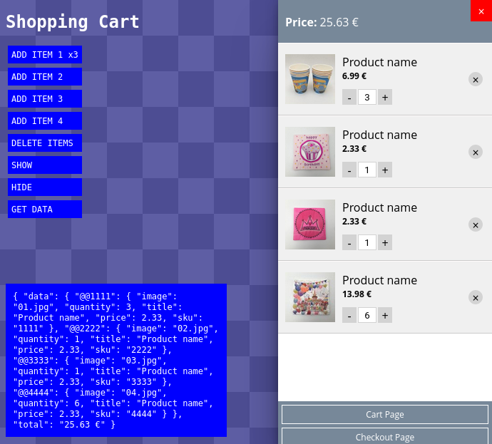

# DsCart.js

**DsCart.js** is a lightweight, customizable JavaScript library for creating a shopping cart system. It supports adding, removing, and managing items, with easy-to-use functions for integration into any website.

## Screenshot



## Features

- Add items to the cart with details such as image, title, price, quantity, and SKU.
- Manage cart items with features like increasing/decreasing quantity, removing items, and clearing the cart.
- Display total price dynamically.
- Show or hide the cart interface.
- Persistent cart data using `localStorage`.

## Demo

A simple HTML demo is included to showcase how DsCart.js can be integrated and used. The demo provides buttons to add items to the cart, remove all items, and toggle the visibility of the cart.

[Check out my CodePen](https://codepen.io/dsijak/pen/wvLroxL) to see a live demo of the project.

## Installation

1. Download the `DsCart.js` file.
2. Include it in your project by adding the following script tag to your HTML file:

```html
<script src="DsCart.js"></script>
```

## Usage

### Initialization

To initialize the cart, call the `initDsCart` function after the page has loaded:

```javascript
window.addEventListener("load", function() {
    initDsCart();
});
```

### Adding Items

You can add items to the cart using the `dsCart.addItem` method:

```javascript
dsCart.addItem({
    'image': 'path_to_image.jpg',
    'quantity': 1,
    'title': 'Product Name',
    'price': 19.99,
    'sku': '1234',
});
```

### Removing Items

To remove an item from the cart, use the `dsCart.removeItem` method:

```javascript
dsCart.removeItem('1234');
```

### Clearing the Cart

To remove all items from the cart:

```javascript
dsCart.deleteAllItems();
```

### Showing and Hiding the Cart

You can control the visibility of the cart with these methods:

```javascript
dsCart.show(); // Show the cart
dsCart.hide(); // Hide the cart
```

### Getting Cart Data

Retrieve all the cart data, including the total price, using the `dsCart.getData` method:

```javascript
let cartData = dsCart.getData();
console.log(cartData);
```

## Customization

You can customize the appearance of the cart by modifying the `_style` variable in the `DsCart.js` file. This variable contains all the CSS styles for the cart interface.


## License

This project is licensed under the BSD License - see the [LICENSE](LICENSE) file for details.

## Author

**Damir Šijaković**  
2024, BSD License
